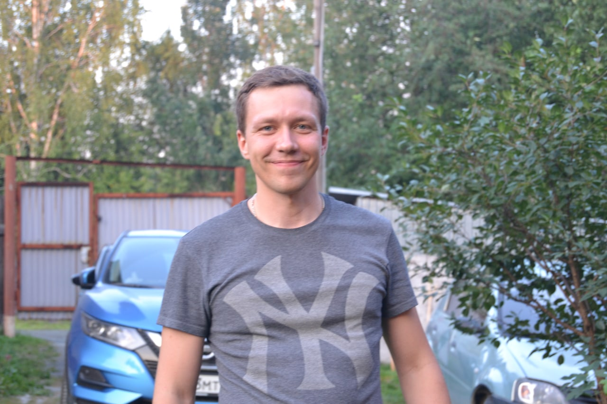

# Квасов Евгений Ильич

## Немного о себе:

Мне 31 год, я женат и у меня есть ребенок.
В 2013 году закончил очную учебу по специальности "Экспертиза и управление недвижимостью" на строительном факультете Уральского Федерального Университета имени первого президента РФ Б.Н. Ельцина.
Всю свою трудовую карьеру (с 2013 года по текущее время) я работаю в строительстве на руководящих должностях (начал мастером, сейчас работаю директором).
Принимал участие как в строительстве новых промышленных объектов, так и в реконструкции и ремонте действующих.
Примерно лет пять назад у меня начало появляться чувство, что я занимаюсь не той деятельностью, которая меня бы устраивала и удовлетворяла. Я занялся анализом, пытался погрузиться (в той или иной мере) в другие профессии, чтоб найти приемлемые для себя варианты.
Итогом таких поисков стала профессия "Frontend-разработчик", на которую я начал учиться с ноября 2021 года (о чем ни разу не пожалел) и намерен продолжать обучение в будущем, постоянно улучшая свои компетенции.

## О моих навыках:

* кросс-браузерная адаптивная и резиновая верстка
* работа с HTML5, CSS3, JS
* работа в команде
* работа с системой контроля версий GIT

